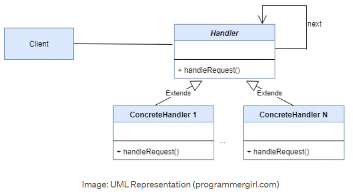

# Chain of Responsibility Pattern

## Introduction

The Chain of Responsibility pattern passes a request along a chain of handlers. Each handler decides either to process the request or to pass it to the next handler in the chain. This decouples the sender of a request from its receiver by giving multiple objects a chance to handle the request.

## Real-World Applications

- **Logging frameworks** – Log messages pass through a chain of loggers (DEBUG → INFO → WARN → ERROR). Each logger decides whether to log based on its severity level.
- **Servlet filters (Java EE)** – A chain of filters processes an HTTP request before it reaches the servlet; each filter can modify, log, or block the request.
- **Middleware pipelines (Express.js, ASP.NET Core)** – Request passes through a sequence of middleware components (auth, logging, compression) before reaching the route handler.
- **Technical support escalation** – A customer issue is handled by Tier 1 support; if unsolved, it escalates to Tier 2, then Tier 3, and finally to a manager.
- **ATM / vending machine dispensers** – Currency notes are dispensed by a chain of handlers for different denominations (₹2000 → ₹500 → ₹100 → ₹50 → ₹10).

## Components

| Component | Description |
|-----------|-------------|
| **Handler** | Declares the interface for handling requests and optionally implementing the successor link. |
| **ConcreteHandler** | Handles requests it is responsible for; otherwise forwards the request to its successor. |
| **Client** | Initiates the request to a handler on the chain. |



## Code Example

### Problem

You are building a logging framework. Different parts of the application require different log levels, and logs should be written to multiple destinations (console, file, email for critical errors). If you hardcode the log routing logic, every change requires modifying the core logging class.

### Solution

The Chain of Responsibility pattern creates a chain of loggers. Each logger has a severity level and a reference to the next logger. A log message travels through the chain; each logger processes it if the severity is at or above its threshold, then passes it along.

```java
// Handler
abstract class Logger {
    public static int DEBUG = 1;
    public static int INFO = 2;
    public static int ERROR = 3;

    protected int level;
    protected Logger nextLogger;

    public void setNext(Logger nextLogger) {
        this.nextLogger = nextLogger;
    }

    public void log(int level, String message) {
        if (this.level <= level) {
            write(message);
        }
        if (nextLogger != null) {
            nextLogger.log(level, message);
        }
    }

    protected abstract void write(String message);
}

// ConcreteHandler
class ConsoleLogger extends Logger {
    public ConsoleLogger(int level) { this.level = level; }
    protected void write(String message) {
        System.out.println("Console: " + message);
    }
}

class FileLogger extends Logger {
    public FileLogger(int level) { this.level = level; }
    protected void write(String message) {
        System.out.println("File: " + message);
    }
}

class EmailLogger extends Logger {
    public EmailLogger(int level) { this.level = level; }
    protected void write(String message) {
        System.out.println("Email: " + message);
    }
}

// Client
public class Main {
    public static void main(String[] args) {
        Logger console = new ConsoleLogger(Logger.DEBUG);
        Logger file = new FileLogger(Logger.INFO);
        Logger email = new EmailLogger(Logger.ERROR);

        console.setNext(file);
        file.setNext(email);

        console.log(Logger.DEBUG, "Debug info");
        console.log(Logger.INFO, "Useful info");
        console.log(Logger.ERROR, "Critical error");
    }
}
```

## Advantages and Disadvantages

### Advantages
- **Decoupling** – The sender and receiver are decoupled; the sender only knows the first handler in the chain.
- **Flexible Assignment** – Handlers can be added, removed, or reordered at runtime.
- **Open/Closed Principle** – New handlers can be added without modifying existing code.
- **Single Responsibility** – Each handler focuses on one type of processing logic.

### Disadvantages
- **No Guarantee of Handling** – A request may reach the end of the chain without being handled if no handler is configured for it.
- **Performance** – A long chain can cause performance overhead, especially if handlers simply pass all requests through.
- **Debugging Difficulty** – Tracing which handler actually processed a request can be hard during debugging.
- **Configuration Errors** – Incorrect chain configuration (e.g., a loop) can cause infinite processing.
