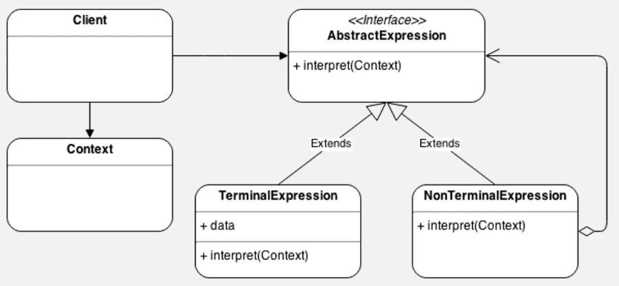

# Interpreter Pattern

## Introduction

The Interpreter pattern defines a grammatical representation for a language and an interpreter that uses the representation to interpret sentences in the language. It is useful for implementing domain-specific languages, expression evaluators, and simple parsers.

## Real-World Applications

- **SQL parsers** – Database systems interpret structured query language (SQL) to execute queries against stored data.
- **Regular expression engines** – Regex patterns are parsed into an abstract syntax tree and interpreted to match text.
- **Mathematical expression evaluators** – A calculator interprets arithmetic expressions like `3 + 5 * (2 - 1)` and computes the result.
- **Configuration file parsers** – Custom DSLs for configuration (e.g., Gradle, Ansible) are interpreted to produce build or deployment plans.
- **Rule engines** – Business rules expressed in a custom DSL are interpreted to make decisions (e.g., "IF age > 18 THEN approved").

## Components

| Component | Description |
|-----------|-------------|
| **AbstractExpression** | Declares an abstract `interpret(Context)` operation that is common to all nodes in the abstract syntax tree. |
| **TerminalExpression** | Implements the `interpret()` operation associated with terminal symbols in the grammar. |
| **NonterminalExpression** | Implements the `interpret()` operation for nonterminal symbols (e.g., AND, OR, PLUS). |
| **Context** | Contains information that is global to the interpreter. |
| **Client** | Builds (or is given) an abstract syntax tree representing a particular sentence. |



## Code Example

### Problem

You need to build a simple expression evaluator that can parse and compute boolean expressions like `true AND false OR true`. Writing a full parser and evaluator from scratch for each new expression type is tedious and error-prone.

### Solution

The Interpreter pattern models the grammar with expression classes. Terminal expressions (`Constant`) represent boolean values. Nonterminal expressions (`And`, `Or`) combine sub-expressions. The client builds an abstract syntax tree and interprets it.

```java
// Context
class Context {
    // Could hold variable bindings for more complex cases
}

// AbstractExpression
interface Expression {
    boolean interpret(Context context);
}

// TerminalExpression
class Constant implements Expression {
    private boolean value;
    public Constant(boolean value) { this.value = value; }
    public boolean interpret(Context context) { return value; }
}

// NonterminalExpression
class And implements Expression {
    private Expression left, right;
    public And(Expression left, Expression right) {
        this.left = left;
        this.right = right;
    }
    public boolean interpret(Context context) {
        return left.interpret(context) && right.interpret(context);
    }
}

class Or implements Expression {
    private Expression left, right;
    public Or(Expression left, Expression right) {
        this.left = left;
        this.right = right;
    }
    public boolean interpret(Context context) {
        return left.interpret(context) || right.interpret(context);
    }
}

class Not implements Expression {
    private Expression expr;
    public Not(Expression expr) { this.expr = expr; }
    public boolean interpret(Context context) {
        return !expr.interpret(context);
    }
}

// Client
public class Main {
    public static void main(String[] args) {
        // Expression: (true AND false) OR NOT false
        Expression expr = new Or(
            new And(new Constant(true), new Constant(false)),
            new Not(new Constant(false))
        );

        Context ctx = new Context();
        System.out.println(expr.interpret(ctx)); // true
    }
}
```

## Advantages and Disadvantages

### Advantages
- **Easy to Extend** – New expression types can be added by creating new concrete expression classes.
- **Simple Grammar** – The pattern works well for small, simple grammars.
- **Separation of Concerns** – The grammar is represented as a set of classes, making it easier to understand and modify.

### Disadvantages
- **Scalability Issues** – For complex grammars, the number of classes grows significantly, making maintenance difficult.
- **Performance** – Deeply nested abstract syntax trees can be slow to interpret compared to compiled approaches.
- **Not Suitable for Complex Languages** – For full programming languages, parser generators (ANTLR, YACC) are far more practical than the Interpreter pattern.
- **Class Explosion** – Each grammar rule typically requires a separate class.
