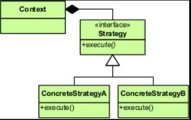

# Strategy Pattern

## Introduction

The Strategy pattern defines a family of algorithms, encapsulates each one, and makes them interchangeable. It lets the algorithm vary independently from the clients that use it, enabling flexible selection of behavior at runtime.

## Real-World Applications

- **Payment processing** – An e-commerce system selects a payment strategy (CreditCard, PayPal, Crypto, BankTransfer) at checkout based on the user's choice.
- **Sorting algorithms** – A data processing tool selects between QuickSort, MergeSort, or BubbleSort based on the dataset size and characteristics.
- **File compression** – A compression utility supports multiple strategies (ZIP, GZIP, RAR, 7z) selected by the user or by file type.
- **Route planning** – A GPS navigation app calculates routes using different strategies (shortest distance, fastest time, scenic route, avoid tolls).
- **Validation rules** – A form validator applies different validation strategies (email, phone, postal code) based on the field type.

## Components

| Component | Description |
|-----------|-------------|
| **Strategy** | Declares an interface common to all supported algorithms. The `Context` uses this interface to call the algorithm defined by a `ConcreteStrategy`. |
| **ConcreteStrategy** | Implements the algorithm using the `Strategy` interface. |
| **Context** | Is configured with a `ConcreteStrategy` object; maintains a reference to a `Strategy` object; may define an interface that lets the strategy access its data. |



## Code Example

### Problem

You are building a navigation app that calculates routes between two points. Initially it only calculated the fastest route. Now users want options: shortest distance, scenic routes, and avoiding highways. If you add each algorithm as a conditional branch inside a single `RouteCalculator` class, the class becomes bloated and violates the Open/Closed Principle.

### Solution

The Strategy pattern encapsulates each routing algorithm in its own class implementing a common `RouteStrategy` interface. The `Navigator` context holds a reference to a strategy and delegates route calculation to it. Users can switch strategies at runtime.

```java
// Strategy
interface RouteStrategy {
    void calculateRoute(String start, String end);
}

// ConcreteStrategy
class FastestRoute implements RouteStrategy {
    public void calculateRoute(String start, String end) {
        System.out.println("Calculating fastest route from " + start + " to " + end);
        // Uses traffic data, speed limits, etc.
    }
}

class ShortestRoute implements RouteStrategy {
    public void calculateRoute(String start, String end) {
        System.out.println("Calculating shortest distance from " + start + " to " + end);
        // Uses Euclidean distance, road network graph
    }
}

class ScenicRoute implements RouteStrategy {
    public void calculateRoute(String start, String end) {
        System.out.println("Calculating scenic route from " + start + " to " + end);
        // Prefers roads near parks, coastlines, landmarks
    }
}

// Context
class Navigator {
    private RouteStrategy strategy;

    public void setStrategy(RouteStrategy strategy) {
        this.strategy = strategy;
    }

    public void navigate(String start, String end) {
        if (strategy == null) {
            System.out.println("Please select a routing strategy");
            return;
        }
        strategy.calculateRoute(start, end);
    }
}

// Client
public class Main {
    public static void main(String[] args) {
        Navigator navigator = new Navigator();

        navigator.setStrategy(new FastestRoute());
        navigator.navigate("Home", "Airport");

        navigator.setStrategy(new ScenicRoute());
        navigator.navigate("Home", "Airport");
    }
}
```

## Advantages and Disadvantages

### Advantages
- **Open/Closed Principle** – New strategies can be added without modifying existing code.
- **Isolation of Algorithm Logic** – Each algorithm is encapsulated in its own class, making it easier to understand, test, and maintain.
- **Runtime Selection** – Algorithms can be swapped at runtime without changing the context.
- **Eliminates Conditionals** – Replaces large conditional blocks with polymorphic delegation.

### Disadvantages
- **Client Awareness** – The client must know about available strategies and choose the appropriate one, increasing client responsibility.
- **Class Explosion** – Each strategy requires a separate class, leading to many small classes.
- **Context-Strategy Coupling** – The context may need to pass data to the strategy, creating coupling between them.
- **Overhead for Simple Algorithms** – If an algorithm has only one variant, the pattern adds unnecessary complexity.
