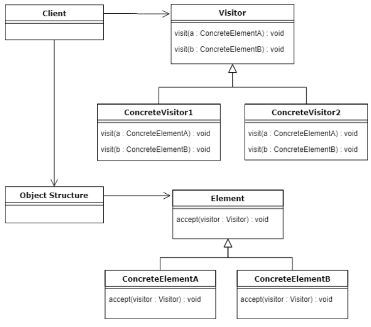

# Visitor Pattern

## Introduction

The Visitor pattern lets you define a new operation on a set of objects without changing the classes of the objects themselves. It separates an algorithm from the object structure it operates on, making it easy to add new operations by creating new visitor classes.

## Real-World Applications

- **Document export** – A document (with Paragraph, Image, Table nodes) supports visitors like `HTMLExportVisitor`, `PDFExportVisitor`, and `TextExportVisitor` without modifying element classes.
- **Compiler ASTs** – An abstract syntax tree supports visitors for type checking, optimization, code generation, and pretty-printing, all without modifying the AST node classes.
- **Tax calculations** – A shopping cart containing different item types (Food, Electronics, Clothing) is visited by a `TaxCalculator` that applies different tax rates per item type.
- **File system traversal** – A file system visitor traverses directories and performs operations (size calculation, search, backup) without modifying file or directory classes.
- **UI component serialization** – A UI component tree is visited by serializers (JSON, XML, YAML) that extract data from each component without changing component classes.

## Components

| Component | Description |
|-----------|-------------|
| **Visitor** | Declares a `visit()` operation for each class of `ConcreteElement` in the object structure. |
| **ConcreteVisitor** | Implements each `visit()` operation declared by the `Visitor`. |
| **Element** | Declares an `accept(Visitor)` operation that takes a visitor as an argument. |
| **ConcreteElement** | Implements the `accept()` operation, which calls the appropriate `visit()` method on the visitor. |
| **ObjectStructure** | Can enumerate its elements; may provide a high-level interface to allow the visitor to visit its elements. |



## Code Example

### Problem

You are building a shape editor with classes for Circle, Square, and Triangle. New requirements keep coming: you need to calculate area, calculate perimeter, render to SVG, render to PNG, export to JSON, and so on. Adding each new operation as a method in every shape class violates the Open/Closed Principle and clutters the shape classes with unrelated logic.

### Solution

The Visitor pattern moves all operations into separate visitor classes. The `Shape` interface declares an `accept(Visitor)` method. Each visitor (e.g., `AreaCalculator`, `SVGRenderer`, `JSONExporter`) implements `visit()` methods for each shape type. Adding a new operation requires only a new visitor class.

```java
// Visitor
interface Visitor {
    void visit(Circle circle);
    void visit(Square square);
    void visit(Triangle triangle);
}

// Element
interface Shape {
    void accept(Visitor visitor);
}

// ConcreteElement
class Circle implements Shape {
    public double radius;
    public Circle(double radius) { this.radius = radius; }

    public void accept(Visitor visitor) {
        visitor.visit(this);
    }
}

class Square implements Shape {
    public double side;
    public Square(double side) { this.side = side; }

    public void accept(Visitor visitor) {
        visitor.visit(this);
    }
}

class Triangle implements Shape {
    public double base, height;
    public Triangle(double base, double height) {
        this.base = base;
        this.height = height;
    }

    public void accept(Visitor visitor) {
        visitor.visit(this);
    }
}

// ConcreteVisitor
class AreaCalculator implements Visitor {
    public void visit(Circle c) {
        System.out.println("Circle area: " + (Math.PI * c.radius * c.radius));
    }

    public void visit(Square s) {
        System.out.println("Square area: " + (s.side * s.side));
    }

    public void visit(Triangle t) {
        System.out.println("Triangle area: " + (0.5 * t.base * t.height));
    }
}

class ShapeDescription implements Visitor {
    public void visit(Circle c) {
        System.out.println("Circle with radius " + c.radius);
    }

    public void visit(Square s) {
        System.out.println("Square with side " + s.side);
    }

    public void visit(Triangle t) {
        System.out.println("Triangle with base " + t.base + " and height " + t.height);
    }
}

// ObjectStructure
class Drawing {
    private List<Shape> shapes = new ArrayList<>();

    public void addShape(Shape shape) { shapes.add(shape); }

    public void accept(Visitor visitor) {
        for (Shape shape : shapes) {
            shape.accept(visitor);
        }
    }
}

// Client
public class Main {
    public static void main(String[] args) {
        Drawing drawing = new Drawing();
        drawing.addShape(new Circle(5));
        drawing.addShape(new Square(4));
        drawing.addShape(new Triangle(3, 6));

        System.out.println("--- Areas ---");
        drawing.accept(new AreaCalculator());

        System.out.println("--- Descriptions ---");
        drawing.accept(new ShapeDescription());
    }
}
```

## Advantages and Disadvantages

### Advantages
- **Open/Closed Principle** – New operations can be added without modifying the element classes.
- **Single Responsibility Principle** – Related behaviors are grouped into a single visitor class instead of being spread across multiple element classes.
- **Accumulate State** – A visitor can accumulate state as it visits each element (e.g., summing areas, building a document).
- **Double Dispatch** – The pattern achieves double dispatch, selecting the correct method based on both the visitor and the element type.

### Disadvantages
- **Adding New Elements is Hard** – Adding a new `ConcreteElement` requires changing the `Visitor` interface and all concrete visitors (violating the Open/Closed Principle).
- **Encapsulation Breach** – Visitors often need access to the element's internal state, which may require exposing private fields or providing public getters that would otherwise be unnecessary.
- **Complexity** – The pattern adds several new classes and interfaces, making the overall design more complex.
- **Circular Dependencies** – The visitor and the element classes depend on each other, which can create tight coupling.
