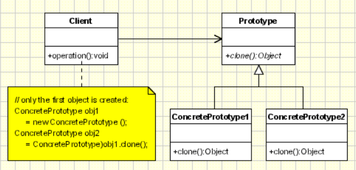

# Prototype Pattern

## Introduction

The Prototype pattern creates new objects by copying an existing object, known as the prototype, rather than instantiating a class directly. It allows an object to create copies of itself without revealing its internal structure to the client.

## Real-World Applications

- **Document editors** – A template document is cloned to create new documents with the same layout and styles.
- **Game development** – Enemy or weapon blueprints are cloned to spawn multiple instances without invoking costly constructors.
- **Graphics software** – Complex shapes and objects are cloned and modified rather than recreated from scratch.
- **Caching** – Expensive-to-create objects (e.g., parsed ASTs, database query results) are stored as prototypes and cloned when needed.
- **Cell replication simulation** – Cells divide by copying themselves, each new cell being a clone of the parent.

## Components

| Component | Description |
|-----------|-------------|
| **Prototype** | Declares an interface for cloning itself, typically a `clone()` method. |
| **ConcretePrototype** | Implements the `Prototype` interface and defines how cloning is performed (shallow or deep copy). |
| **Client** | Creates new objects by asking a prototype to clone itself, rather than calling a constructor. |



## Code Example

### Problem

You are building a game where the player faces waves of enemies. Each enemy type (Goblin, Orc, Dragon) has a complex configuration – health, armor, weapons, spells – that is expensive to construct from scratch every time. Instantiating these directly leads to repetitive setup code and performance overhead.

### Solution

The Prototype pattern lets you pre-configure a single prototype for each enemy type. When a new enemy is needed, the prototype is cloned. The clone can then be tweaked without affecting the original.

```java
// Prototype
interface Enemy extends Cloneable {
    Enemy clone();
    void attack();
}

// ConcretePrototype
class Goblin implements Enemy {
    private int health;
    private int speed;
    private String weapon;

    public Goblin(int health, int speed, String weapon) {
        this.health = health;
        this.speed = speed;
        this.weapon = weapon;
    }

    public Enemy clone() {
        return new Goblin(this.health, this.speed, this.weapon);
    }

    public void attack() {
        System.out.println("Goblin attacks with " + weapon);
    }

    // Setters for customization
    public void setHealth(int health) { this.health = health; }
}

// Client
public class Main {
    public static void main(String[] args) {
        Goblin baseGoblin = new Goblin(50, 10, "Dagger");

        Goblin eliteGoblin = (Goblin) baseGoblin.clone();
        eliteGoblin.setHealth(100); // Customize the clone

        baseGoblin.attack();
        eliteGoblin.attack();
    }
}
```

## Advantages and Disadvantages

### Advantages
- **Reduced Cost** – Avoids expensive constructor calls and repeated initialization logic.
- **Hides Complexity** – Clients can create copies without knowing the object's internal structure.
- **Dynamic Configuration** – Prototypes can be configured at runtime and cloned as needed.
- **Fewer Subclasses** – The pattern eliminates the need for a parallel Creator hierarchy (as in Factory Method).

### Disadvantages
- **Deep Copy Complexity** – Cloning objects with nested references requires careful deep-copy logic, especially with circular references.
- **Clone Method Support** – Not all languages provide a built-in `Cloneable` interface; implementing it correctly can be error-prone.
- **Object Identity** – Clients may forget to treat the clone as a separate instance and accidentally share state with the prototype.
