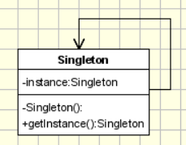

# Singleton Pattern

## Introduction

The Singleton pattern ensures that a class has only one instance and provides a global point of access to that instance. It is used when exactly one object is needed to coordinate actions across the system.

## Real-World Applications

- **Database connection pools** – A single `ConnectionPool` manages all database connections to prevent resource exhaustion.
- **Logging services** – A single `Logger` instance writes log entries from all parts of the application without file contention.
- **Configuration managers** – Application-wide settings are loaded once and served from a single `Config` object.
- **Thread pools** – A single `ThreadPool` instance manages worker threads across the application.
- **Print spoolers** – A single `PrintSpooler` ensures print jobs are queued and processed sequentially.

## Components

| Component | Description |
|-----------|-------------|
| **Singleton** | Defines a static method `getInstance()` that returns the same instance every time. The constructor is hidden from client code. |
| **Client** | Accesses the Singleton only through the `getInstance()` method. |



## Code Example

### Problem

Your application needs a central configuration manager that reads settings from a file at startup. If multiple parts of the application create separate configuration objects, each will re-read the file, waste resources, and potentially serve stale data. Worse, mutable settings could become inconsistent across instances.

### Solution

The Singleton pattern ensures only one `ConfigManager` exists. The constructor is private, and a static `getInstance()` method controls access to the single instance. Thread-safety is handled with a double-checked locking mechanism (or an `enum` in modern Java).

```java
// Singleton (thread-safe with double-checked locking)
class ConfigManager {
    private static volatile ConfigManager instance;
    private Map<String, String> config;

    private ConfigManager() {
        config = new HashMap<>();
        // Load configuration from file
        config.put("url", "jdbc:mysql://localhost:3306/db");
        config.put("timeout", "5000");
    }

    public static ConfigManager getInstance() {
        if (instance == null) {
            synchronized (ConfigManager.class) {
                if (instance == null) {
                    instance = new ConfigManager();
                }
            }
        }
        return instance;
    }

    public String get(String key) {
        return config.get(key);
    }
}

// Client
public class Main {
    public static void main(String[] args) {
        ConfigManager cfg = ConfigManager.getInstance();
        System.out.println(cfg.get("url"));
    }
}
```

### Enum Singleton (Java recommended approach)

```java
enum ConfigManager {
    INSTANCE;

    private final Map<String, String> config;

    ConfigManager() {
        config = new HashMap<>();
        config.put("url", "jdbc:mysql://localhost:3306/db");
        config.put("timeout", "5000");
    }

    public String get(String key) {
        return config.get(key);
    }
}
```

## Advantages and Disadvantages

### Advantages
- **Controlled Access** – The Singleton prevents other objects from creating their own copies of the resource.
- **Reduced Memory Footprint** – Only one instance exists, saving memory.
- **Lazy Initialization** – The instance is created only when it is first requested (in the lazy variant).
- **Global Access** – The instance is accessible from anywhere in the application without passing it around.

### Disadvantages
- **Global State** – Singletons introduce global state into an application, making testing and debugging harder.
- **Tight Coupling** – Classes that use the Singleton become tightly coupled to it, reducing flexibility.
- **Concurrency Issues** – Thread-safe initialization requires careful synchronization (double-checked locking or an enum).
- **Testability** – Singletons are difficult to mock or stub in unit tests because their constructors are private.
- **Single Responsibility Violation** – The Singleton class is responsible both for its primary logic and for managing its own lifecycle.
