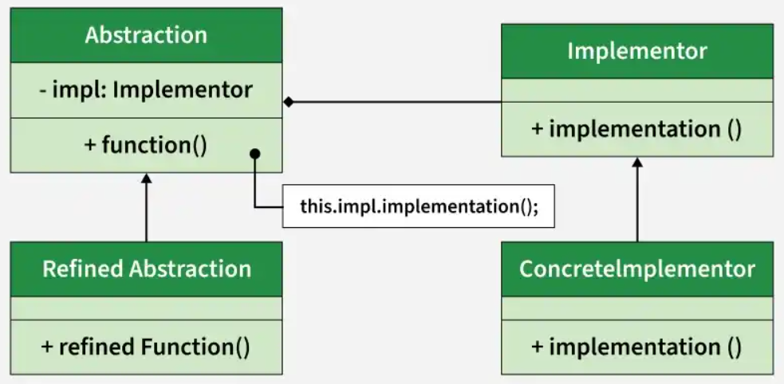

# Bridge Pattern

## Introduction

The Bridge pattern decouples an abstraction from its implementation so that the two can vary independently. Instead of binding an abstraction to a fixed implementation via inheritance, the pattern uses composition to connect the abstraction to an implementation interface.

## Real-World Applications

- **Cross-platform graphics rendering** – A `Shape` abstraction delegates to a `Renderer` implementation. The same shapes (Circle, Square) work with OpenGL, DirectX, or Vulkan renderers without multiplying classes.
- **Remote controls and devices** – A `RemoteControl` abstraction works with any `Device` implementation (TV, Radio, Projector), and both hierarchies can evolve separately.
- **Database drivers (JDBC)** – The JDBC API is an abstraction; the actual connection is handled by vendor-specific drivers (MySQL, PostgreSQL, Oracle).
- **Payment processing** – A `PaymentMethod` abstraction (CreditCard, PayPal, Crypto) delegates to different `PaymentGateway` implementations (Stripe, PayPal API, Coinbase).

## Components

| Component | Description |
|-----------|-------------|
| **Abstraction** | Defines the high-level control interface; maintains a reference to the `Implementor`. |
| **RefinedAbstraction** | Extends the `Abstraction` interface. |
| **Implementor** | Defines the interface for implementation classes. |
| **ConcreteImplementor** | Implements the `Implementor` interface and defines the concrete implementation. |



## Code Example

### Problem

You are building a drawing application that renders shapes (Circle, Square, Triangle) on different platforms (Windows, macOS, Linux). Using inheritance, you would need classes like `WindowsCircle`, `MacCircle`, `LinuxCircle`, `WindowsSquare`, and so on. Adding a new shape or a new platform multiplies the class count exponentially.

### Solution

The Bridge pattern splits the hierarchy into two dimensions: shapes (abstraction) and renderers (implementation). A `Shape` holds a reference to a `Renderer`. Each shape delegates its drawing to the renderer. Adding a new shape or a new renderer requires only one new class.

```java
// Implementor
interface Renderer {
    void renderCircle(int x, int y, int radius);
    void renderSquare(int side);
}

// ConcreteImplementor
class DirectXRenderer implements Renderer {
    public void renderCircle(int x, int y, int radius) {
        System.out.println("DirectX: Circle at (" + x + "," + y + ") radius " + radius);
    }
    public void renderSquare(int side) {
        System.out.println("DirectX: Square of side " + side);
    }
}

class OpenGLRenderer implements Renderer {
    public void renderCircle(int x, int y, int radius) {
        System.out.println("OpenGL: Circle at (" + x + "," + y + ") radius " + radius);
    }
    public void renderSquare(int side) {
        System.out.println("OpenGL: Square of side " + side);
    }
}

// Abstraction
abstract class Shape {
    protected Renderer renderer;
    public Shape(Renderer renderer) {
        this.renderer = renderer;
    }
    public abstract void draw();
}

// RefinedAbstraction
class Circle extends Shape {
    private int x, y, radius;
    public Circle(Renderer renderer, int x, int y, int radius) {
        super(renderer);
        this.x = x;
        this.y = y;
        this.radius = radius;
    }
    public void draw() {
        renderer.renderCircle(x, y, radius);
    }
}

class Square extends Shape {
    private int side;
    public Square(Renderer renderer, int side) {
        super(renderer);
        this.side = side;
    }
    public void draw() {
        renderer.renderSquare(side);
    }
}

public class Main {
    public static void main(String[] args) {
        Renderer dx = new DirectXRenderer();
        Renderer ogl = new OpenGLRenderer();

        Shape circle = new Circle(dx, 10, 20, 5);
        Shape square = new Square(ogl, 15);

        circle.draw();
        square.draw();
    }
}
```

## Advantages and Disadvantages

### Advantages
- **Independent Hierarchies** – Abstraction and implementation can evolve independently without affecting each other.
- **Open/Closed Principle** – New abstractions and new implementations can be added without modifying existing code.
- **Reduced Class Explosion** – Avoids the combinatorial explosion of classes that occurs with pure inheritance.
- **Single Responsibility Principle** – The abstraction focuses on high-level logic; the implementation handles platform-specific details.

### Disadvantages
- **Complexity** – The pattern adds indirection and requires careful design of two parallel hierarchies.
- **Increased Code** – More interfaces and classes are needed compared to a simple inheritance approach.
- **Design Overhead** – Deciding which dimensions to separate into abstraction vs. implementation requires foresight.
