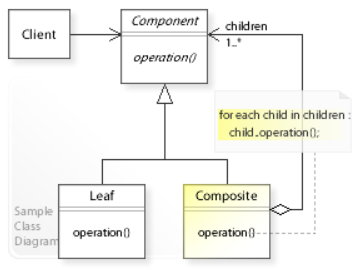

# Composite Pattern

## Introduction

The Composite pattern composes objects into tree structures to represent part-whole hierarchies. It lets clients treat individual objects and compositions of objects uniformly, allowing recursive composition without burdening the client with the distinction.

## Real-World Applications

- **File systems** – Files (leaf) and directories (composite) share a common `FileSystemNode` interface. Directories can contain files or other directories.
- **Graphics editors** – Simple shapes (Circle, Square) and groups of shapes (Group) both implement a `Graphic` interface that supports `draw()`, `move()`, and `resize()`.
- **UI component trees** – A GUI framework represents windows, panels, buttons, and text fields in a tree. A panel can contain buttons and other panels.
- **Organizational structures** – Employees and departments (`OrgUnit`) form a tree where a department can contain employees and sub-departments.
- **Menu systems** – Menu items and submenus both implement a `MenuItem` interface, allowing nested menu structures.

## Components

| Component | Description |
|-----------|-------------|
| **Component** | Declares the interface for objects in the composition. |
| **Leaf** | Represents leaf objects that have no children. |
| **Composite** | Defines behavior for components having children; stores child components; implements child-related operations in the `Component` interface. |
| **Client** | Manipulates objects in the composition through the `Component` interface. |



## Code Example

### Problem

You are building a file system explorer. Files and directories share many operations (getName(), getSize(), display()), but directories can contain files or other directories. Without a common abstraction, the client must use `instanceof` checks and conditional logic to handle files and directories differently, making the code brittle and hard to extend.

### Solution

The Composite pattern defines a common `FileSystemNode` interface for both files and directories. Directories store a list of children and delegate operations like `getSize()` to their children recursively. The client works uniformly with both leaf and composite nodes.

```java
// Component
interface FileSystemNode {
    String getName();
    long getSize();
    void display(String indent);
}

// Leaf
class File implements FileSystemNode {
    private String name;
    private long size;

    public File(String name, long size) {
        this.name = name;
        this.size = size;
    }

    public String getName() { return name; }
    public long getSize() { return size; }

    public void display(String indent) {
        System.out.println(indent + "File: " + name + " (" + size + " bytes)");
    }
}

// Composite
class Directory implements FileSystemNode {
    private String name;
    private List<FileSystemNode> children = new ArrayList<>();

    public Directory(String name) {
        this.name = name;
    }

    public void add(FileSystemNode node) { children.add(node); }
    public void remove(FileSystemNode node) { children.remove(node); }

    public String getName() { return name; }

    public long getSize() {
        long total = 0;
        for (FileSystemNode child : children) {
            total += child.getSize();
        }
        return total;
    }

    public void display(String indent) {
        System.out.println(indent + "Directory: " + name);
        for (FileSystemNode child : children) {
            child.display(indent + "  ");
        }
    }
}

// Client
public class Main {
    public static void main(String[] args) {
        Directory root = new Directory("root");
        root.add(new File("readme.txt", 100));
        root.add(new File("logo.png", 500));

        Directory src = new Directory("src");
        src.add(new File("Main.java", 200));
        src.add(new File("Utils.java", 150));
        root.add(src);

        root.display("");
        System.out.println("Total size: " + root.getSize() + " bytes");
    }
}
```

## Advantages and Disadvantages

### Advantages
- **Uniformity** – Clients treat individual objects and compositions uniformly through the same interface.
- **Recursive Composition** – Easily builds deeply nested hierarchical structures.
- **Open/Closed Principle** – New component types can be added without changing existing client code.
- **Simplified Client** – The client does not need to know whether it is dealing with a leaf or a composite.

### Disadvantages
- **Overly General Interface** – The `Component` interface may include methods that only make sense for composites (e.g., `add()`, `remove()`), forcing leaf classes to implement them with no-ops or exceptions.
- **Type Safety** – The pattern trades compile-time safety for uniformity; a client might accidentally add a child to a leaf at runtime.
- **Traversal Cost** – Traversing deep composite trees can be expensive if not optimized.
