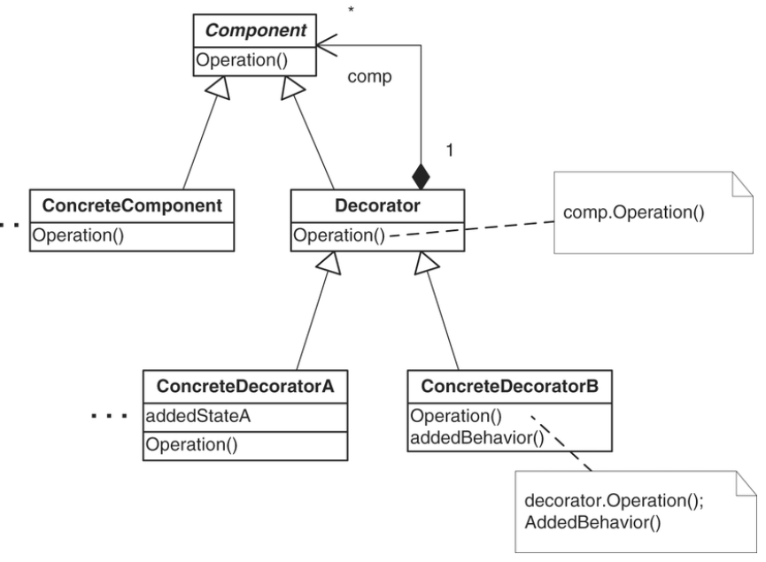

# Decorator Pattern

## Introduction

The Decorator pattern attaches additional responsibilities to an object dynamically. It provides a flexible alternative to subclassing for extending functionality by wrapping an object in a decorator class that mirrors the wrapped object's interface.

## Real-World Applications

- **Java I/O streams** – `BufferedReader`, `LineNumberReader`, and `DataInputStream` are decorators that wrap `InputStream` or `Reader` objects to add buffering, line counting, and data-type reading.
- **UI component enhancement** – A `ScrollableWindow` decorator adds scrollbars to a `Window`, and a `BorderedWindow` decorator adds a border; decorators can be composed.
- **Pizza ordering systems** – A base pizza is wrapped with decorators for extra toppings (cheese, pepperoni, mushrooms), each adding to the description and cost.
- **Middleware pipelines** – HTTP request/response filters are stacked decorators that add logging, authentication, compression, and caching.

## Components

| Component | Description |
|-----------|-------------|
| **Component** | Defines the interface for objects that can have responsibilities added dynamically. |
| **ConcreteComponent** | Defines an object to which additional responsibilities can be attached. |
| **Decorator** | Maintains a reference to a `Component` object and defines an interface that conforms to `Component`'s interface. |
| **ConcreteDecorator** | Adds responsibilities to the component. |



## Code Example

### Problem

You are building a notification system that can send alerts via email, SMS, and Slack. The requirements frequently change – sometimes you need to send a single channel, sometimes multiple, and the combination logic keeps growing. Using inheritance to define every combination (EmailAndSMSNotification, EmailAndSlackNotification, etc.) leads to class explosion.

### Solution

The Decorator pattern defines a `Notifier` interface with a `send()` method. Concrete decorators wrap a `Notifier` and add their own behavior before or after delegating to the wrapped notifier. Decorators can be stacked to compose any combination of channels.

```java
// Component
interface Notifier {
    void send(String message);
}

// ConcreteComponent
class EmailNotifier implements Notifier {
    public void send(String message) {
        System.out.println("Sending email: " + message);
    }
}

// Decorator
abstract class NotifierDecorator implements Notifier {
    protected Notifier wrapped;

    public NotifierDecorator(Notifier notifier) {
        this.wrapped = notifier;
    }

    public void send(String message) {
        wrapped.send(message);
    }
}

// ConcreteDecorator
class SMSNotifierDecorator extends NotifierDecorator {
    public SMSNotifierDecorator(Notifier notifier) {
        super(notifier);
    }

    public void send(String message) {
        super.send(message);
        System.out.println("Sending SMS: " + message);
    }
}

class SlackNotifierDecorator extends NotifierDecorator {
    public SlackNotifierDecorator(Notifier notifier) {
        super(notifier);
    }

    public void send(String message) {
        super.send(message);
        System.out.println("Sending Slack message: " + message);
    }
}

// Client
public class Main {
    public static void main(String[] args) {
        Notifier notifier = new EmailNotifier();
        notifier = new SMSNotifierDecorator(notifier);
        notifier = new SlackNotifierDecorator(notifier);
        notifier.send("Server is down!");
    }
}
```

## Advantages and Disadvantages

### Advantages
- **Open/Closed Principle** – New behaviors can be added without modifying existing code.
- **Composable** – Decorators can be stacked at runtime to achieve any combination of behaviors.
- **Single Responsibility Principle** – Each decorator handles one specific concern, keeping classes focused.
- **Alternatives to Subclassing** – Avoids class explosion by composing behavior dynamically rather than statically via inheritance.

### Disadvantages
- **Complexity from Many Small Classes** – A large number of tiny decorator classes can make the system harder to navigate.
- **Order Sensitivity** – The order in which decorators are stacked can matter, and incorrect ordering may produce unexpected behavior.
- **Object Identity** – Since decorators wrap objects, the original object's identity is lost; `==` comparison and `instanceof` checks become unreliable.
- **Configuration Overhead** – Setting up the right stack of decorators can require verbose client code.
