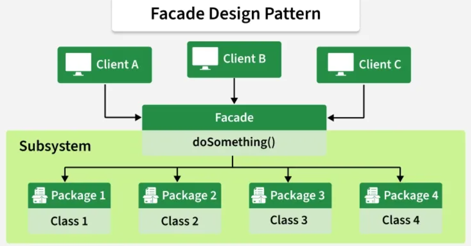

# Facade Pattern

## Introduction

The Facade pattern provides a unified, simplified interface to a set of interfaces in a subsystem. It defines a higher-level interface that makes the subsystem easier to use by reducing complexity and hiding the intricate interactions between components.

## Real-World Applications

- **Home theater systems** – A single "Watch Movie" button on a remote control triggers a facade that dims the lights, lowers the screen, turns on the projector, sets the audio input, and starts the Blu-ray player.
- **API gateways** – A single REST endpoint aggregates calls to multiple backend microservices, hiding the internal service choreography from the client.
- **Compiler subsystems** – A `Compiler` facade exposes a single `compile()` method that internally orchestrates lexing, parsing, semantic analysis, optimization, and code generation.
- **Banking operations** – A `BankingFacade` provides simple methods like `transfer(from, to, amount)` that internally handle account validation, fraud checks, balance updates, and notifications.

## Components

| Component | Description |
|-----------|-------------|
| **Facade** | Provides a simple interface to the more complex subsystem; delegates client requests to the appropriate subsystem objects. |
| **Subsystem Classes** | Implement the actual functionality; they handle the detailed work but are unaware of the facade. |
| **Client** | Uses the facade instead of calling the subsystem classes directly. |



## Code Example

### Problem

You are building a home theater system. Turning on a movie requires the user to dim the lights (with specific brightness), lower the projection screen, turn on the projector and set its input, power on the amplifier with the correct surround-sound mode, and start the Blu-ray player. The client code must know the correct order and configuration for each component, making it error-prone and tightly coupled to the internals of each device.

### Solution

The Facade pattern introduces a `HomeTheaterFacade` that exposes a simple `watchMovie(String movie)` method. The facade encapsulates the entire startup sequence, shielding the client from the subsystem's complexity.

```java
// Subsystem classes
class Lights {
    public void dim(int percentage) {
        System.out.println("Lights dimmed to " + percentage + "%");
    }
    public void on() { System.out.println("Lights on"); }
}

class Screen {
    public void lower() { System.out.println("Screen lowered"); }
    public void raise() { System.out.println("Screen raised"); }
}

class Projector {
    public void on() { System.out.println("Projector on"); }
    public void setInput(String input) { System.out.println("Projector input set to " + input); }
    public void off() { System.out.println("Projector off"); }
}

class Amplifier {
    public void on() { System.out.println("Amplifier on"); }
    public void setSurroundSound() { System.out.println("Surround sound enabled"); }
    public void off() { System.out.println("Amplifier off"); }
}

class BluRayPlayer {
    public void on() { System.out.println("Blu-ray player on"); }
    public void play(String movie) { System.out.println("Playing " + movie); }
    public void off() { System.out.println("Blu-ray player off"); }
}

// Facade
class HomeTheaterFacade {
    private Lights lights;
    private Screen screen;
    private Projector projector;
    private Amplifier amp;
    private BluRayPlayer player;

    public HomeTheaterFacade() {
        this.lights = new Lights();
        this.screen = new Screen();
        this.projector = new Projector();
        this.amp = new Amplifier();
        this.player = new BluRayPlayer();
    }

    public void watchMovie(String movie) {
        System.out.println("--- Starting movie ---");
        lights.dim(20);
        screen.lower();
        projector.on();
        projector.setInput("Blu-ray");
        amp.on();
        amp.setSurroundSound();
        player.on();
        player.play(movie);
    }

    public void endMovie() {
        System.out.println("--- Ending movie ---");
        player.off();
        amp.off();
        projector.off();
        screen.raise();
        lights.on();
    }
}

// Client
public class Main {
    public static void main(String[] args) {
        HomeTheaterFacade homeTheater = new HomeTheaterFacade();
        homeTheater.watchMovie("Inception");
        homeTheater.endMovie();
    }
}
```

## Advantages and Disadvantages

### Advantages
- **Simplified Interface** – The facade hides the complexity of the subsystem behind a clean, easy-to-use API.
- **Decoupling** – Client code is decoupled from the subsystem classes, making the client simpler and the subsystem easier to change.
- **Reduced Compilation Dependencies** – The client only depends on the facade, not on every subsystem class.
- **Single Entry Point** – A facade can provide sensible defaults and orchestration logic, guiding clients toward correct usage.

### Disadvantages
- **Limited Client Control** – The facade may not expose all the functionality that advanced clients need; they may need to bypass it.
- **God Object Risk** – A poorly designed facade can become a "god object" that knows too much about the subsystem, violating the Single Responsibility Principle.
- **No Encapsulation Guarantee** – The subsystem classes are still accessible; a determined client can call them directly, bypassing the facade.
